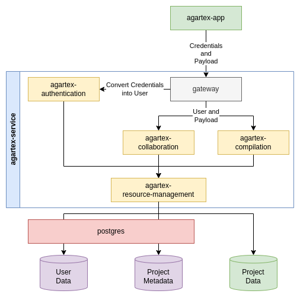

# Agartex Service Core

Repository containing all scripts required to run AgarTex on your local machine.

Before you start:
1. Copy `example-secrets` to `secrets` and fill them with your configuration
2. Pull or build Docker images:
  * [agaross.azurecr.io/agar-oss/agartex-app](https://github.com/Agar-OSS/agartex-app)
  * [agaross.azurecr.io/agar-oss/agartex-service](https://github.com/Agar-OSS/agartex-service)
3. Start app with `docker-compose up`

Infrastructure is under refactoring and some of the information may be outdated.

## Infrastructure overview

