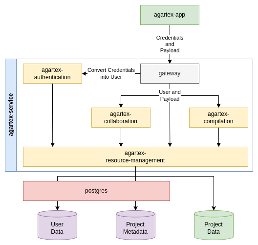

# Agartex Service Core

Repository containing all scripts required to run AgarTex on your local machine.

Before you start:
1. Copy `example-secrets` to `secrets` and fill them with your configuration
2. Pull or build Docker images:
  * [agaross.azurecr.io/agar-oss/agartex-app](https://github.com/Agar-OSS/agartex-app)
  * [agaross.azurecr.io/agar-oss/agartex-authentication](https://github.com/Agar-OSS/agartex-authentication)
  * [agaross.azurecr.io/agar-oss/agartex-resource-management](https://github.com/Agar-OSS/agartex-resource-management)
  * [agaross.azurecr.io/agar-oss/agartex-compilation](https://github.com/Agar-OSS/agartex-compilation)
  * [agaross.azurecr.io/agar-oss/agartex-collaboration](https://github.com/Agar-OSS/agartex-collaboration)
3. Start app with `docker-compose up`
4. [optional] If you want to enable TLS, copy `.envExample` to `.env` and set path to your certificates

It is advised to run it in background (e.g. using `screen`).

## Infrastructure overview

